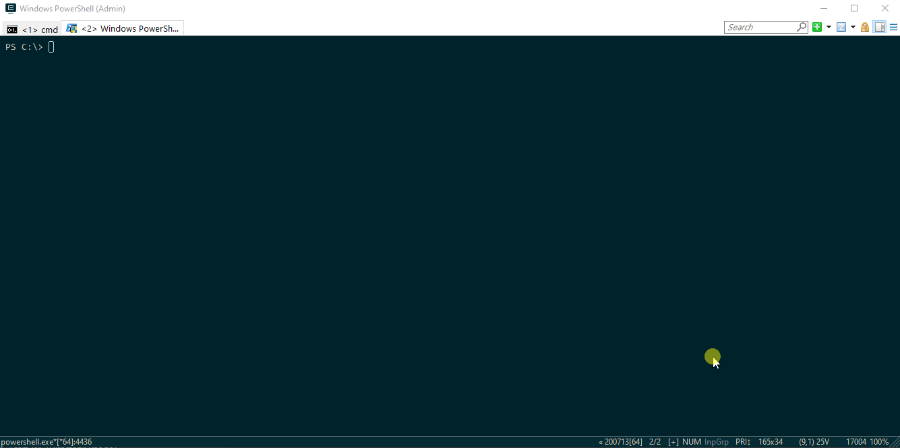

# WS1AccessAdminAPI


PowerShell module to interact with VMware WorkSpace One Access API.  
*VMware Workspace one access (WS1Access) or VMware Identiry Manager (VIDM)*  

## Basic Usage

```Powershell
Install-Module WS1AccessAdminAPI -Force
Import-Module WS1AccessAdminAPI -Force
Get-Module -Name WS1AccessAdminAPI
Get-Command -Module WS1AccessAdminAPI
Get-WS1LoginSessionToken -Tenant "example.vmware.com" -LocalAdminUSR "Admin" -LocalAdminPWD "P@ssw0rd"
```
  
  

*Most of the functions could be executed as is outside the module scope.*  
Place the *WS1AccessAdminAPI* module folder to:  
`$home\Documents\WindowsPowerShell\Modules` OR `$pshome\Modules` (Win&Linux)  

@Docs: <https://docs.microsoft.com/en-us/powershell/module/microsoft.powershell.core/about/about_modules?view=powershell-7#how-to-install-a-module>  

```Powershell
Import-Module -Name WS1AccessAdminAPI
Get-Module -Name WS1AccessAdminAPI
Get-Command -Module WS1AccessAdminAPI
```
  
*More usage examples could be found under 'Examples' folder.*

## WS1Access Configuration

App Registration: One time only  
*create a service client on WS1Access*:  

1. Log into the Workspace ONE Access console.
2. Click the arrow on the **Catalog** tab and select **Settings**.
3. Click **Remote App Access** in the left pane.
4. Click **Create Client**.
5. For **Access Type**, select **Service Client Token**.
6. For **Client ID**, enter an ID, for example, APIAccess.
7. Expand the **Advanced** section.
8. Click **Generate Shared Secret**.

  
@*Source*: <https://github.com/vmware/idm/wiki/Integrating-Client-Credentials-app-with-OAuth2#app-registration-one-time-only>  

# Suggestions and feedback

If you have any idea or suggestion - please add a github issue.  
Contribution is welcome.  
WS1Access API has poor documentation,  
plenty of the functionality was collected by pieces from external resources (e.g forums, repos, Admin UI etc).  
